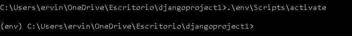
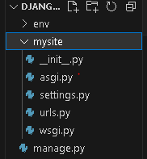
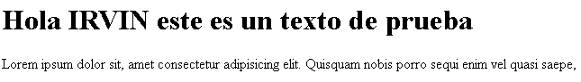

<table>
    <theader>
        <tr>
            <td></td>
            <th>
                UNIVERSIDAD NACIONAL DE SAN AGUSTIN 
                FACULTAD DE INGENIERÍA DE PRODUCCIÓN Y SERVICIOS 
                DEPARTAMENTO ACADÉMICO DE INGENIERÍA DE SISTEMAS E INFORMÁTICA 
                ESCUELA PROFESIONAL DE INGENIERÍA DE SISTEMAS
            </th>
            <td></td>
        </tr>
    </theader>
    <tbody>
        <tr><td colspan="3">Formato: Guía de Práctica de Laboratorio</td></tr>
        <tr><td>Aprobación:  2022/03/01</td><td>Código: GUIA-PRLD-001</td><td>Página: 1</td></tr>
    </tbody>
</table>

GUÍA DE LABORATORIO 

<table>
<theader>
<tr><th colspan="6">INFORMACIÓN BÁSICA</th></tr>
</theader>
<tbody>
<tr><td>ASIGNATURA:</td><td colspan="5">Programación Web 2</td></tr>
<tr><td>TÍTULO DE LA PRÁCTICA:</td><td colspan="5">Django</td></tr>
<tr>
<td>NÚMERO DE PRÁCTICA:</td><td>06</td><td>AÑO LECTIVO:</td><td>2023 A</td><td>NRO. SEMESTRE:</td><td>III</td>
</tr>
<tr>
<td>FECHA INICIO::</td><td>23-Junio-2022</td><td>FECHA FIN:</td><td>04-Julio-2022</td><td>DURACIÓN:</td><td>04 horas</td>
</tr>
<tr><td colspan="6">RECURSOS:
    <ul>
        <li><a href="https://www.youtube.com/watch?v=OTmQOjsl0eg">https://www.youtube.com/watch?v=OTmQOjsl0eg</a></li>        
    </ul>
</td>
</<tr>
<tr><td colspan="6">DOCENTES:
<ul>
<li>Anibal Sardon </li>
</ul>
</td>
</<tr>
</tdbody>
</table>

# Django

[![License][license]][license-file]
[![Downloads][downloads]][releases]
[![Last Commit][last-commit]][releases]

[![Debian][Debian]][debian-site]
[![Git][Git]][git-site]
[![GitHub][GitHub]][github-site]
[![Vim][Vim]][vim-site]
[![Java][Java]][java-site]

#

## OBJETIVOS Y TEMAS

### OBJETIVOS

- Implementar una aplicación en Django utilizando una plantilla profesional.
- Utilizar una tabla de Destinos turísticos para leer y completar la página web.
- Utilizar los tags “if” y “for” en los archivos html para leer todos los registros de
una tabla desde una base de datos.

### TEMAS
- Proyectos de Django
- Aplicaciones en Django
- Plantillas Profesionales
- Tags para vistas dinámicas

### MARCO TEORICO
- Un framework es una abstracción en la cual se puede reusar código y funcionalidades
adaptándolos a nuestras necesidades.
- Un modelo en un framework se suele referir a los datos y su organización
- Una vista permite apreciar el resultado de la lectura de una tabla incluida en una página
web.

### ACTIVIDADES
1. Crear un proyecto en Django
2. Siga los pasos del video para poder implementar la aplicación de Destinos
turísticos
3. Use git y haga los commits necesarios para manejar correctamente la aplicación.

### EJERCICIOS PROPUESTOS
1. Deberán replicar la actividad del video donde se obtiene una plantilla de una aplicación de Destinos turísticos y adecuarla a un proyecto en blanco Django.
2. Luego trabajar con un modelo de tabla DestinosTuristicos donde se guarden nombreCiudad, descripcionCiudad, imagenCiudad, precioTour, ofertaTour (booleano). Estos destinos turísticos deberán ser agregados en una vista dinámica utilizando tags for e if.
3. Para ello crear una carpeta dentro del proyecto github colaborativo con el docente, e informar el link donde se encuentra.
4. Crear formularios de Añadir Destinos Turísticos, Modificar, Listar y Eliminar Destinos.
5. Eres libre de agregar CSS para decorar tu trabajo.
6. Ya sabes que el trabajo con Git es obligatorio. Revisa el avance de la teoría Django parte 4

#

## INFORME DE LABORATORIO

- Instalamos Python y Visual Studio Code.

    - 

- Creamos una carpeta que se llamara DjangoProject la cual contendra el proyecto.

- Instalamos el entorno virtual.
    
    - 

- Creamos nuestro entorno virtual(env)

    - 

- Activamos nuestro entorno virtual

    - 

- Ahora abrimos esta carpeta en Visual Studio Code.

    - 

- Ahora Instalamos Django en el entorno virtual

    - 

- Verificamos que se instalo correctamente

    - 
  
- Ahora empezaremos a crear nuestro primer Proyecto

    - 
    - 

- Ejecutamos nuestro proyecto

    - 

- Ahora verifiquemos si nuestro proyecto funciona

    - 

- Creamos un archivo donde vamos a desarrollar la aplicación

    - 
    - 

- Ahora vamos a crear un Hola Mundo.
- Para esto primero creamos su propia urls.py

    - 
    - 

- Dentro de views.py importamos HttpResponse y creamos la función

    - 

- Dentro de la urls.py del proyecto importamos path y include

    - 

- Ejecutamos el Proyecto 

    - 
    - 
    - 

- Creamos la carpeta templates para realizar plantillas.

    -  

- Importamos os en settings.py, especificamos las rutas

    -  
    -  
    -  
    -  
  
- Para realizar de manera dinamica

    - 

    - 
  
    - 

- Uso de los métodos GET y POST

     - 

     - 

     - 

     - 

- Ahora usaremos una plantilla
- En un inicio nos queda de esta manera por que aun no usamos los archivos css, js y imagenes.

    -  

- Ahora la página estatica

    -  
    -  
 
- Commits
    -  
    -  
    -  
    -  
    -  
    -  
    -  
    -  
    -  
    -  
    -  
    -  
     
    
#

## REFERENCIAS
- Django tutorial. https://www.youtube.com/watch?v=OTmQOjsl0eg&t=1885s
- https://developer.mozilla.org/en-US/docs/Learn/Server-side/Django/Tutorial_local_library_website
- https://github.com/mdn/django-locallibrary-tutorial
- https://github.com/rescobedoq/pw2/tree/main/labs/lab05
- https://docs.djangoproject.com/en/4.1/ref/models/fields/
- https://stackoverflow.com/questions/3330435/is-there-an-sqlite-equivalent-to-mysqls-describe-table

#

[license]: https://img.shields.io/github/license/rescobedoq/pw2?label=rescobedoq
[license-file]: https://github.com/rescobedoq/pw2/blob/main/LICENSE

[downloads]: https://img.shields.io/github/downloads/rescobedoq/pw2/total?label=Downloads
[releases]: https://github.com/rescobedoq/pw2/releases/

[last-commit]: https://img.shields.io/github/last-commit/rescobedoq/pw2?label=Last%20Commit

[Debian]: https://img.shields.io/badge/Debian-D70A53?style=for-the-badge&logo=debian&logoColor=white
[debian-site]: https://www.debian.org/index.es.html

[Git]: https://img.shields.io/badge/git-%23F05033.svg?style=for-the-badge&logo=git&logoColor=white
[git-site]: https://git-scm.com/

[GitHub]: https://img.shields.io/badge/github-%23121011.svg?style=for-the-badge&logo=github&logoColor=white
[github-site]: https://github.com/

[Vim]: https://img.shields.io/badge/VIM-%2311AB00.svg?style=for-the-badge&logo=vim&logoColor=white
[vim-site]: https://www.vim.org/

[Java]: https://img.shields.io/badge/java-%23ED8B00.svg?style=for-the-badge&logo=java&logoColor=white
[java-site]: https://docs.oracle.com/javase/tutorial/

[![Debian][Debian]][debian-site]
[![Git][Git]][git-site]
[![GitHub][GitHub]][github-site]
[![Vim][Vim]][vim-site]
[![Java][Java]][java-site]

[![License][license]][license-file]
[![Downloads][downloads]][releases]
[![Last Commit][last-commit]][releases]
